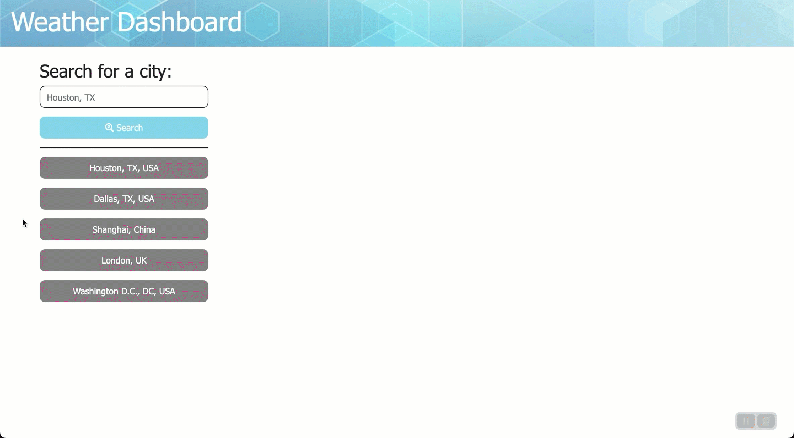
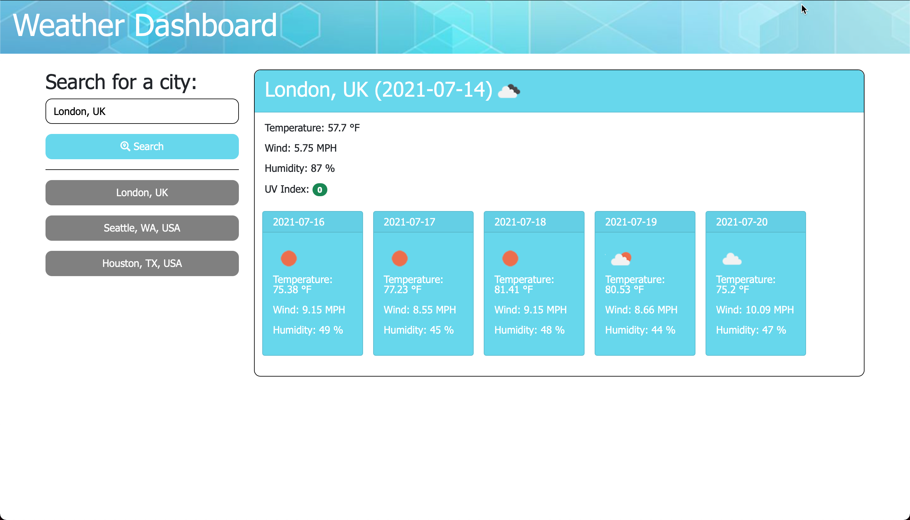
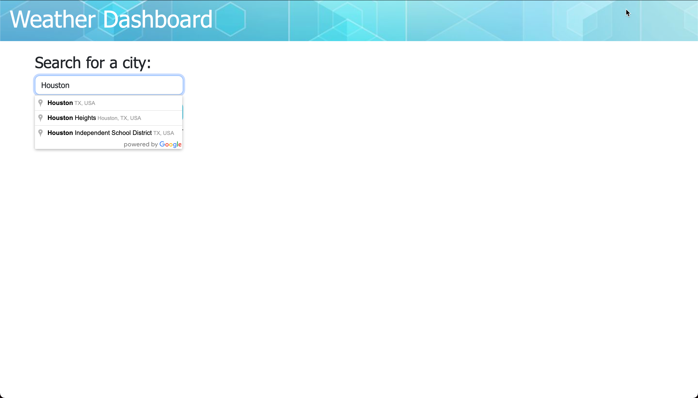

# Weather Dashboard
## Description
Using the [OpenWeather One Call API](https://openweathermap.org/api/one-call-api) to retrieve weather data for cities we have created a simple dashboard to see what the weather is in a city.

## Usage
You can access the app here: [https://avidrunner87.github.io/weather-dashboard/](https://avidrunner87.github.io/weather-dashboard/).

## User Story
**AS A(N)** traveler 
I **WANT** to see the weather outlook for multiple cities 
**SO THAT** I can plan a trip accordingly
### Acceptance Criteria
**GIVEN** a weather dashboard with form inputs

>WHEN I search for a city 
THEN I am presented with current and future conditions for that city and that city is added to the search history

>WHEN I view current weather conditions for that city 
THEN I am presented with the city name, the date, an icon representation of weather conditions, the temperature, the humidity, the wind speed, and the UV index

>WHEN I view the UV index 
THEN I am presented with a color that indicates whether the conditions are favorable, moderate, or severe

>WHEN I view future weather conditions for that city 
THEN I am presented with a 5-day forecast that displays the date, an icon representation of weather conditions, the temperature, the wind speed, and the humidity

>WHEN I click on a city in the search history 
THEN I am again presented with current and future conditions for that city

## Licenses

## Technologies

## Mock-up
The following picture shows the website appearance and capabilities:

 

## Installation
To fork this code to further improve the website, please follow these directions:

1. In Github fork the repository.
1. Clone the repository to your local computer.

_This assumes that you have setup your own SSH keys to connect with Github._

## References
[MDN Web Docs](https://developer.mozilla.org/en-US/docs/Web/HTML/Element) 
[W3 Schools](https://www.w3schools.com/) 
[jQuery](https://jquery.com) 
[jQueryUI](https://jqueryui.com) 
[Moment JS](https://momentjs.com/) 
[Background Image](https://www.bates.edu/wordpress/blueprints/header-background-images/)
